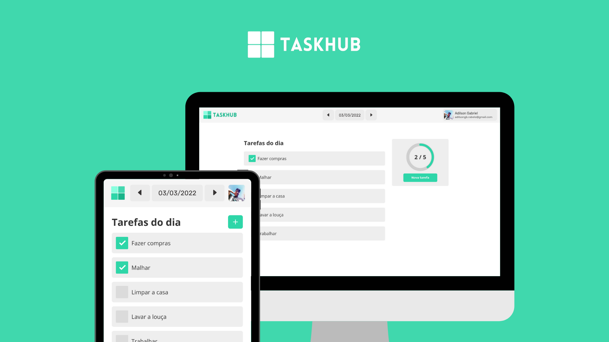

# TaskHub &middot;   




## 🧙 Descrição do projeto

Aplicação de lista de tarefas diárias capaz de salvar o progresso do usuário na data em que a tarefa foi registrada.

## 🧭 Funcionalidades

:heavy_check_mark: Sistema de login com o Google;

:heavy_check_mark: Armazena as task na data que foram criadas;

:heavy_check_mark: Informa o progesso do dia;

:heavy_check_mark: Design responsivo (mobile).

## 👨🏽‍💻 Desenvolvimento 

### 🔧 Desenvolvido com

- React.js
- Context API
- Firebase
- JavaScript
- HTML
- CSS

### 💎 Pré-requisitos

- Node.js: v14.0.0 ou superior

### ⚙️ Configuração do ambiente de desenvolvimento

- Clone este repositório:

```shell
git clone git@github.com:adilsongb/taskhub.git
```

- Acesse o diretório do projeto:

```shell
cd taskhub/
```

- Instale as dependências com o seguinte comando:

```shell
npm install
```

- Execute a aplicação em tempo real com o seguinte comando:

```shell
npm start
```

### 🌻 Implantação / Publicação

Após o desenvolvimento do código, salve as mudanças usando o Git:

```shell
git add .
git commit -m "New features"
```

Envie as mudanças para o repositório no GitHub:

```shell
git push
```

O processo de Build e de Deploy é feito pelo Firebase através de uma `Action`.

> Qualquer mudança na branch `master` inicia o processo de implantação.

## 🚀 Ajustes e melhorias

Veja a seguir uma checklist de features que ainda faltam desenvolver nesse projeto. Fique a vontade para contribuir, sua ajuda é sempre bem-vinda.

##### Tasks

- [ ] Ao criar uma nova task, será possível adicionar links, imagens, listas e checklists nos detalhes da tarefa
- [ ] Mostrar detalhes de uma task
  - [ ] É possível editar uma task
  - [ ] É possível excluir uma task
- [ ] Adicionar botão para excluir uma task na tela de "Tarefas do dia"

##### Calendário

- [ ] O calendário deve ser preenchido com a cor `#45d398` nos dias em que há tasks salvas

##### Configurações

- [ ] Criar página de configurações com as seguintes features:
  - [ ] Opção para trocar foto do usuário
  - [ ] Opção para trocar cores da aplicação (incluindo Darkmode)
  - [ ] Reset de dados por dia ou de todos os dias
  - [ ] Apagar conta

##### Estatísticas

- [ ] Cria página de estatísticas com as seguintes features:
  - [ ] Mostrar gráfico de quantas tasks foram criadas, e se há tasks concluídas ou pendentes
